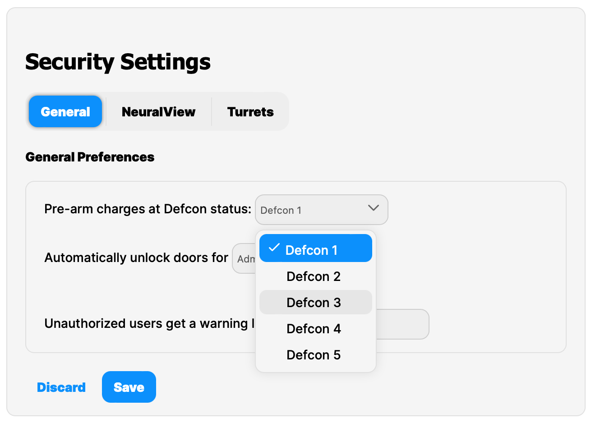

# bsnkui Vue UI Component Library

bsnkui is a Vue Component Library in alpha with the goals of being lean through shipping at <50KB for everything, tree-shakeable,
modern, and to have a good developer experience. It's also not designed to feature redundant utilities, so you can use
your favorite utility library to lay out your website.

## Design

bsnkui is designed for desktop first to enable web-app development. It aims to support mobile platforms but it is not
the primary goal of the library.

## Current Size Status

<code>
dist/style.css      15.53 KiB / gzip: 2.91 KiB 
dist/bsnkui.es.js   37.73 KiB / gzip: 7.41 KiB 
dist/bsnkui.umd.js   21.51 KiB / gzip: 5.88 KiB 
</code>

## Development Roadmap

There isn't much of a roadmap for this. It's a personal project to build a custom UI more inline with practicality than
form. There is limited professional design planning, or an actual design guide to be enforced.

However, the following features are wanted:

- Dark mode 
- better color customization
- More UI components, unknown at this time.
